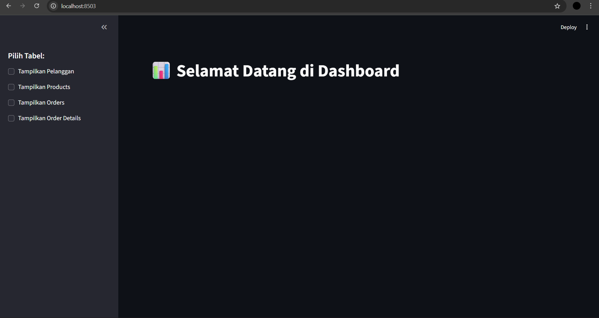
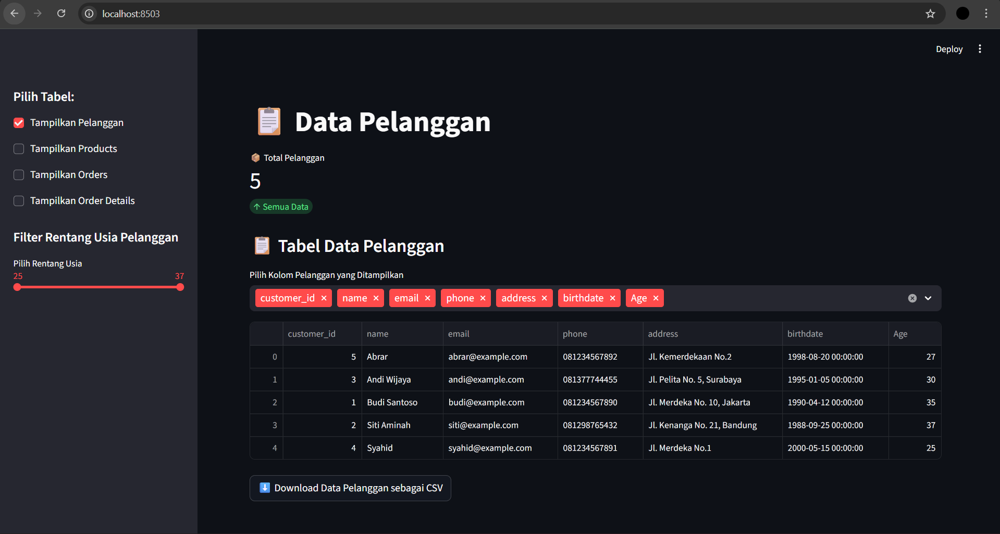
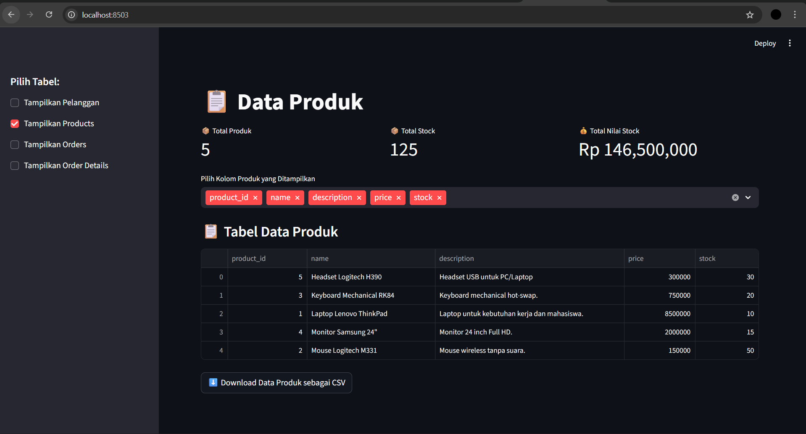
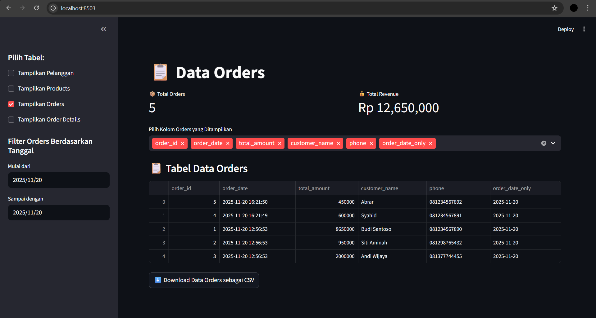
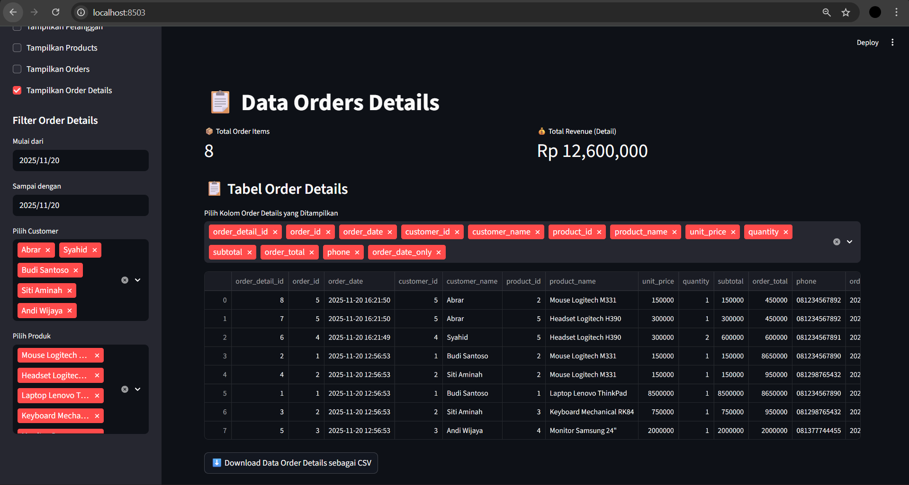

# Tugas 5
Melanjutkan main.py untuk visualisasi data

---
Nama: Muhammad Syahid Ridho

Nim: 10241051

---

## Kode lengkap `main.py`
```py
import streamlit as st
import pandas as pd
from datetime import datetime
from config import *

# KONFIGURASI HALAMAN
st.set_page_config("Dashboard", page_icon="📊", layout="wide")

# DATA PELANGGAN
result_customers = view_customers()
df_customers = pd.DataFrame(result_customers, columns=[
    "customer_id", "name", "email", "phone", "address", "birthdate"
])
df_customers['birthdate'] = pd.to_datetime(df_customers['birthdate'])
df_customers['Age'] = (datetime.now() - df_customers['birthdate']).dt.days // 365

def tabelCustomers_dan_export():
    st.title("📋 Data Pelanggan")
    total_customers = df_customers.shape[0]
    col1, col2, col3 = st.columns(3)
    with col1:
        st.metric("📦 Total Pelanggan", total_customers, delta="Semua Data")

    st.sidebar.header("Filter Rentang Usia Pelanggan")
    min_age = int(df_customers['Age'].min())
    max_age = int(df_customers['Age'].max())
    age_range = st.sidebar.slider(
        "Pilih Rentang Usia",
        min_value=min_age,
        max_value=max_age,
        value=(min_age, max_age)
    )

    filtered_df = df_customers[df_customers['Age'].between(*age_range)]

    st.markdown("### 📋 Tabel Data Pelanggan")
    showdata = st.multiselect(
        "Pilih Kolom Pelanggan yang Ditampilkan",
        options=filtered_df.columns,
        default=list(filtered_df.columns)
    )
    st.dataframe(filtered_df[showdata], use_container_width=True)

    @st.cache_data
    def convert_df_to_csv(_df):
        return _df.to_csv(index=False, sep=';', encoding='utf-8-sig').encode('utf-8-sig')

    csv = convert_df_to_csv(filtered_df[showdata])
    st.download_button("⬇️ Download Data Pelanggan sebagai CSV", data=csv, file_name='data_pelanggan.csv', mime='text/csv')


# DATA PRODUCTS
result_products = view_products()
df_products = pd.DataFrame(result_products, columns=[
    "product_id", "name", "description", "price", "stock"
])

def tabelProducts_dan_export():
    st.title("📋 Data Produk")
    total_products = df_products.shape[0]
    total_stock = df_products['stock'].sum()
    total_value = (df_products['price'] * df_products['stock']).sum()

    col1, col2, col3 = st.columns(3)
    with col1:
        st.metric("📦 Total Produk", total_products)
    with col2:
        st.metric("📦 Total Stock", total_stock)
    with col3:
        st.metric("💰 Total Nilai Stock", f"Rp {total_value:,.0f}")

    showdata = st.multiselect(
        "Pilih Kolom Produk yang Ditampilkan",
        options=df_products.columns,
        default=list(df_products.columns)
    )

    st.markdown("### 📋 Tabel Data Produk")
    st.dataframe(df_products[showdata], use_container_width=True)

    @st.cache_data
    def convert_df_to_csv(_df):
        return _df.to_csv(index=False, sep=';', encoding='utf-8-sig').encode('utf-8-sig')

    csv = convert_df_to_csv(df_products[showdata])
    st.download_button("⬇️ Download Data Produk sebagai CSV", data=csv, file_name='data_products.csv', mime='text/csv')


# DATA ORDERS
result_orders = view_orders_with_customers()
df_orders = pd.DataFrame(result_orders, columns=[
    "order_id", "order_date", "total_amount", "customer_name", "phone"
])
df_orders['order_date'] = pd.to_datetime(df_orders['order_date'])
df_orders['order_date_only'] = df_orders['order_date'].dt.date

def tabelOrders_dan_export():
    st.title("📋 Data Orders")
    total_orders = df_orders.shape[0]
    total_revenue = df_orders['total_amount'].sum()

    col1, col2 = st.columns(2)
    with col1:
        st.metric("📦 Total Orders", total_orders)
    with col2:
        st.metric("💰 Total Revenue", f"Rp {total_revenue:,.0f}")

    st.sidebar.header("Filter Orders Berdasarkan Tanggal")
    start_date = st.sidebar.date_input("Mulai dari", df_orders['order_date_only'].min(), key="start_order")
    end_date = st.sidebar.date_input("Sampai dengan", df_orders['order_date_only'].max(), key="end_order")

    filtered_df = df_orders[
        (df_orders['order_date_only'] >= start_date) &
        (df_orders['order_date_only'] <= end_date)
    ]

    showdata = st.multiselect(
        "Pilih Kolom Orders yang Ditampilkan",
        options=filtered_df.columns,
        default=list(filtered_df.columns)
    )

    st.markdown("### 📋 Tabel Data Orders")
    st.dataframe(filtered_df[showdata], use_container_width=True)

    @st.cache_data
    def convert_df_to_csv(_df):
        return _df.to_csv(index=False, sep=';', encoding='utf-8-sig').encode('utf-8-sig')

    csv = convert_df_to_csv(filtered_df[showdata])
    st.download_button("⬇️ Download Data Orders sebagai CSV", data=csv, file_name='data_orders.csv', mime='text/csv')


# DATA ORDER DETAILS
result_order_details = view_order_details_with_info()
df_order_details = pd.DataFrame(result_order_details, columns=[
    "order_detail_id", "order_id", "order_date", "customer_id", "customer_name",
    "product_id", "product_name", "unit_price", "quantity", "subtotal", "order_total", "phone"
])
df_order_details['order_date'] = pd.to_datetime(df_order_details['order_date'])
df_order_details['order_date_only'] = df_order_details['order_date'].dt.date

def tabelOrderDetails_dan_export():
    st.title("📋 Data Orders Details")
    total_details = df_order_details.shape[0]
    total_revenue = df_order_details['subtotal'].sum()

    col1, col2 = st.columns(2)
    with col1:
        st.metric("📦 Total Order Items", total_details)
    with col2:
        st.metric("💰 Total Revenue (Detail)", f"Rp {total_revenue:,.0f}")

    st.sidebar.header("Filter Order Details")
    
    start_date = st.sidebar.date_input("Mulai dari", df_order_details['order_date_only'].min(), key="start_od")
    end_date = st.sidebar.date_input("Sampai dengan", df_order_details['order_date_only'].max(), key="end_od")

    customers_list = df_order_details['customer_name'].unique().tolist()
    selected_customers = st.sidebar.multiselect("Pilih Customer", options=customers_list, default=customers_list)

    products_list = df_order_details['product_name'].unique().tolist()
    selected_products = st.sidebar.multiselect("Pilih Produk", options=products_list, default=products_list)

    filtered_df = df_order_details[
        (df_order_details['order_date_only'] >= start_date) &
        (df_order_details['order_date_only'] <= end_date) &
        (df_order_details['customer_name'].isin(selected_customers)) &
        (df_order_details['product_name'].isin(selected_products))
    ]

    st.markdown("### 📋 Tabel Order Details")
    showdata = st.multiselect(
        "Pilih Kolom Order Details yang Ditampilkan",
        options=filtered_df.columns,
        default=list(filtered_df.columns)
    )
    st.dataframe(filtered_df[showdata], use_container_width=True)

    @st.cache_data
    def convert_df_to_csv(_df):
        return _df.to_csv(index=False, sep=';', encoding='utf-8-sig').encode('utf-8-sig')

    csv = convert_df_to_csv(filtered_df[showdata])
    st.download_button("⬇️ Download Data Order Details sebagai CSV", data=csv, file_name='data_order_details.csv', mime='text/csv')


# SIDEBAR UNTUK MEMILIH TABEL
st.sidebar.header("Pilih Tabel:")

show_customers = st.sidebar.checkbox("Tampilkan Pelanggan")
show_products = st.sidebar.checkbox("Tampilkan Products")
show_orders = st.sidebar.checkbox("Tampilkan Orders")
show_order_details = st.sidebar.checkbox("Tampilkan Order Details")


# HALAMAN AWAL 
if not any([show_customers, show_products, show_orders, show_order_details]):
    st.title("📊 Selamat Datang di Dashboard")
else:
    if show_customers:
        tabelCustomers_dan_export()
    if show_products:
        tabelProducts_dan_export()
    if show_orders:
        tabelOrders_dan_export()
    if show_order_details:
        tabelOrderDetails_dan_export()
```

---

## 2. Penjelasan Kode `main.py`

## Kode Customers
```python
# Ambil data pelanggan dari database
result_customers = view_customers()
df_customers = pd.DataFrame(result_customers, columns=[
    "customer_id", "name", "email", "phone", "address", "birthdate"
])
df_customers['birthdate'] = pd.to_datetime(df_customers['birthdate'])
df_customers['Age'] = (datetime.now() - df_customers['birthdate']).dt.days // 365
```
Kode ini memanggil fungsi view_customers() dari file `config.py` untuk mengambil data pelanggan dari database. Setiap hasil query kemudian diubah menjadi DataFrame Pandas `(df_customers)`.
Kolom birthdate dikonversi menjadi tipe datetime agar bisa dihitung usianya, dan kolom Age dihitung berdasarkan selisih tanggal lahir dan tanggal saat ini.

### Kode Fungsi meampilkan data
```py
def tabelCustomers_dan_export():
    st.title("📋 Data Pelanggan")
    total_customers = df_customers.shape[0]
    col1, col2, col3 = st.columns(3)
    with col1:
        st.metric("📦 Total Pelanggan", total_customers, delta="Semua Data")

    st.sidebar.header("Filter Rentang Usia Pelanggan")
    min_age = int(df_customers['Age'].min())
    max_age = int(df_customers['Age'].max())
    age_range = st.sidebar.slider(
        "Pilih Rentang Usia",
        min_value=min_age,
        max_value=max_age,
        value=(min_age, max_age)
    )

    filtered_df = df_customers[df_customers['Age'].between(*age_range)]

    st.markdown("### 📋 Tabel Data Pelanggan")
    showdata = st.multiselect(
        "Pilih Kolom Pelanggan yang Ditampilkan",
        options=filtered_df.columns,
        default=list(filtered_df.columns)
    )
    st.dataframe(filtered_df[showdata], use_container_width=True)

    @st.cache_data
    def convert_df_to_csv(_df):
        return _df.to_csv(index=False, sep=';', encoding='utf-8-sig').encode('utf-8-sig')

    csv = convert_df_to_csv(filtered_df[showdata])
    st.download_button("⬇️ Download Data Pelanggan sebagai CSV", data=csv, file_name='data_pelanggan.csv', mime='text/csv')
```
---
### Penjelasan Kode Produk
```python
result_products = view_products()
df_products = pd.DataFrame(result_products, columns=[
    "product_id", "name", "description", "price", "stock"
])
```
Memanggil `view_products()` untuk mengambil semua produk.
Data disimpan di DataFrame `(df_products)` dengan kolom penting: nama, deskripsi, harga, dan stock.

### Kode fungsi menampilkan data
```py
def tabelProducts_dan_export():
    st.title("📋 Data Produk")
    st.markdown("### 📋 Tabel Data Produk")
    showdata = st.multiselect(
        "Pilih Kolom Produk yang Ditampilkan",
        options=df_products.columns,
        default=list(df_products.columns)
    )
    st.dataframe(df_products[showdata], use_container_width=True)

    @st.cache_data
    def convert_df_to_csv(_df):
        return _df.to_csv(index=False, sep=';', encoding='utf-8-sig').encode('utf-8-sig')

    csv = convert_df_to_csv(df_products[showdata])
    st.download_button("⬇️ Download Data Produk sebagai CSV", data=csv, file_name='data_produk.csv', mime='text/csv')

```
Fungsi `tabelProducts_dan_export` menampilkan data produk secara interaktif di dashboard Streamlit. User dapat memilih kolom mana saja yang ingin ditampilkan agar tabel lebih ringkas dan fokus, melihat tabel yang responsif menyesuaikan lebar layar, serta mengunduh data yang ditampilkan ke file CSV yang kompatibel untuk dibuka di Excel.

---

### Penjelasan Kode Order
```py
result_orders = view_orders_with_customers()
df_orders = pd.DataFrame(result_orders, columns=[
    "order_id", "order_date", "total_amount", "customer_name", "phone"
])
df_orders['order_date'] = pd.to_datetime(df_orders['order_date'])
df_orders['order_date_only'] = df_orders['order_date'].dt.date
```
Memanggil `view_orders_with_customers()` untuk mengambil semua order beserta info pelanggan.
Data disimpan di DataFrame `(df_orders)`, kolom `order_date` dikonversi ke datetime, dan dibuat kolom `order_date_only` untuk filter tanggal tanpa waktu.

### Kode fungsi menampilkan data order
```py
def tabelOrders_dan_export():
    st.title("📋 Data Orders")
    st.markdown("### 📋 Tabel Data Orders")
    showdata = st.multiselect(
        "Pilih Kolom Orders yang Ditampilkan",
        options=df_orders.columns,
        default=list(df_orders.columns)
    )
    st.dataframe(df_orders[showdata], use_container_width=True)

    @st.cache_data
    def convert_df_to_csv(_df):
        return _df.to_csv(index=False, sep=';', encoding='utf-8-sig').encode('utf-8-sig')

    csv = convert_df_to_csv(df_orders[showdata])
    st.download_button("⬇️ Download Data Orders sebagai CSV", data=csv, file_name='data_orders.csv', mime='text/csv')
```
Fungsi `tabelOrders_dan_export` menampilkan data pesanan beserta nama customer dan nomor telepon secara interaktif. User bisa memilih kolom yang ingin ditampilkan, melihat tabel responsif, dan mengunduh data ke file CSV. Tanggal order dikonversi agar memudahkan filter berdasarkan waktu, sehingga analisis lebih mudah.

---
### Penjelesan Kode Order Details
```py
result_order_details = view_order_details_with_info()
df_order_details = pd.DataFrame(result_order_details, columns=[
    "order_detail_id", "order_id", "order_date", "customer_id", "customer_name",
    "product_id", "product_name", "unit_price", "quantity", "subtotal", "order_total", "phone"
])
df_order_details['order_date'] = pd.to_datetime(df_order_details['order_date'])
df_order_details['order_date_only'] = df_order_details['order_date'].dt.date
```
Memanggil `view_order_details_with_info()` untuk mengambil detail tiap order beserta info customer dan produk.
Data disimpan di DataFrame `(df_order_details)`, kolom order_date dikonversi, dibuat kolom tambahan `order_date_only` untuk filter tanggal.

### Kode fungsi menampilkan data order details
```py
def tabelOrderDetails_dan_export():
    st.title("📋 Data Orders Details")
    st.markdown("### 📋 Tabel Detail Orders")
    customer_filter = st.sidebar.multiselect("Filter Customer", options=df_order_details['customer_name'].unique(), default=df_order_details['customer_name'].unique())
    product_filter = st.sidebar.multiselect("Filter Product", options=df_order_details['product_name'].unique(), default=df_order_details['product_name'].unique())
    filtered_df = df_order_details[(df_order_details['customer_name'].isin(customer_filter)) & (df_order_details['product_name'].isin(product_filter))]

    showdata = st.multiselect(
        "Pilih Kolom Detail Orders yang Ditampilkan",
        options=filtered_df.columns,
        default=list(filtered_df.columns)
    )
    st.dataframe(filtered_df[showdata], use_container_width=True)

    @st.cache_data
    def convert_df_to_csv(_df):
        return _df.to_csv(index=False, sep=';', encoding='utf-8-sig').encode('utf-8-sig')

    csv = convert_df_to_csv(filtered_df[showdata])
    st.download_button("⬇️ Download Data Detail Orders CSV", data=csv, file_name='data_order_details.csv', mime='text/csv')

```
Fungsi `tabelOrderDetails_dan_export ` menampilkan detail setiap order, termasuk nama customer, produk, harga satuan, jumlah, subtotal, dan total order. User dapat memfilter berdasarkan customer dan produk, memilih kolom yang ingin ditampilkan, melihat tabel responsif, dan mengunduh data ke file CSV untuk analisis lebih lanjut.

---
### Kode tampilan awal dan sidebar
```py
# SIDEBAR UNTUK MEMILIH TABEL
st.sidebar.header("Pilih Tabel:")

show_customers = st.sidebar.checkbox("Tampilkan Pelanggan")
show_products = st.sidebar.checkbox("Tampilkan Products")
show_orders = st.sidebar.checkbox("Tampilkan Orders")
show_order_details = st.sidebar.checkbox("Tampilkan Order Details")


# HALAMAN AWAL 
if not any([show_customers, show_products, show_orders, show_order_details]):
    st.title("📊 Selamat Datang di Dashboard")
else:
    if show_customers:
        tabelCustomers_dan_export()
    if show_products:
        tabelProducts_dan_export()
    if show_orders:
        tabelOrders_dan_export()
    if show_order_details:
        tabelOrderDetails_dan_export()
```
Kode ini mengatur navigasi utama dashboard menggunakan sidebar sebagai kontrol untuk memilih tabel mana yang ingin ditampilkan. Setiap checkbox mewakili satu jenis data: pelanggan, produk, orders, dan detail order. Jika tidak ada checkbox yang dipilih, aplikasi menampilkan halaman awal berupa judul dashboard.

---
# Screenshot Tampilan
1. Tampilan halaman awal 


2. Tampilan data pelanggan


3. Tampilan data produk


4. Tampilan data orders


5. Tampilan data order details
   

File lengkap ada di Github:
